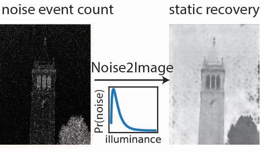

# Code for "Noise2Image: Noise-Enabled Static Scene Recovery for Event Cameras"

<p align="center">

</p>

<p align="center">
    <a style="text-decoration:none !important;" href="https://arxiv.org/abs/2404.01298" alt="arXiv"> </a>
    <a style="text-decoration:none !important;" href="https://berkeley.box.com/s/z9s21gs3tyrfpngzl9he66mr9s4kp1up" alt="DOI"></a>
</p>

## Requirements
- conda or miniconda
- CUDA-enabled GPU with at least 10GB of memory

## Setup instruction
1. Initialize virtual env
    ```
    conda create -n virtualenv_name python=3.10
    conda activate virtualenv_name
    ```

2. Install dependencies
    ```
    conda install pytorch~=2.1.0 torchvision==0.16.1 torchaudio pytorch-cuda=11.8 -c pytorch -c nvidia
    (optional, only for visualization) conda install -c conda-forge jupyterlab nodejs ipympl matplotlib
    pip install -r requirements.txt
    ```

## Noise-event-to-image dataset
1. Download dataset from [Box drive](https://berkeley.box.com/s/z9s21gs3tyrfpngzl9he66mr9s4kp1up)
2. Unzip them into `data` folder

## Usage
- Train & evaluate using experimental data
    ```
    python train.py --polarity
    ```

- Train using synthetic data & evaluate using experimental data
    ```
    python train_synthetic.py
    ```

- Other optional flags
    ```
    options:
    -h, --help            show help message
    --gpu_ind GPU_IND     GPU index
    --num_epochs NUM_EPOCHS
                          Number of epochs
    --lr LR               Learning rate
    --batch_size BATCH_SIZE
                          Batch size
    --log_name LOG_NAME   Name of the log & checkpoint folder under ./lightning_logs.
    --pixel_bin PIXEL_BIN
                          Pixel binning during the event aggregation.
    --polarity            Aggregate events into 2 channels for positive and negative polarities. 
                          For experimental data training only.
    --integration_time_s INTEGRATION_TIME_S
                          Event aggregation time in seconds. Default is 1s. For experimental data 
                          training only.
    ```

## Citation
```
@article{cao2024noise2image,
  title={Noise2Image: Noise-Enabled Static Scene Recovery for Event Cameras},
  author={Cao, Ruiming and Galor, Dekel and Kohli, Amit and Yates, Jacob L and Waller, Laura},
  journal={arXiv preprint arXiv:2404.01298},
  year={2024}
}
```
Equal contribution from Ruiming Cao (rcao@berkeley.edu) and Dekel Galor (galor@berkeley.edu)